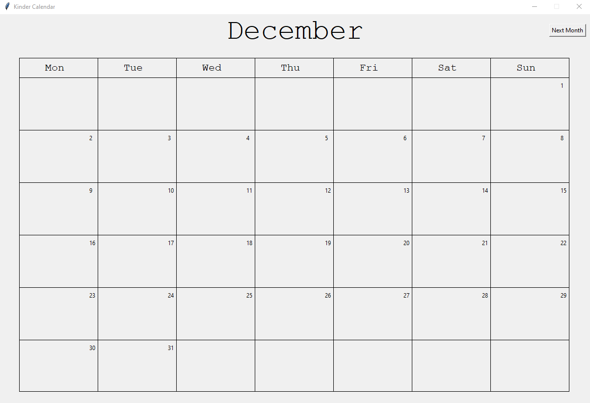

# Calendario
Personal Calendar in Python with tkinter

## Project Idea<ul>
<li>Build a personal calendar with events that can be added to each day.</li>
</ul>

## Desperately Needed Improvements<ul>
<li>Switch from using .txt files to store month and event data to a database.</li>
</ul>

## Currently Abandoned
Last modified: July 24, 2018
